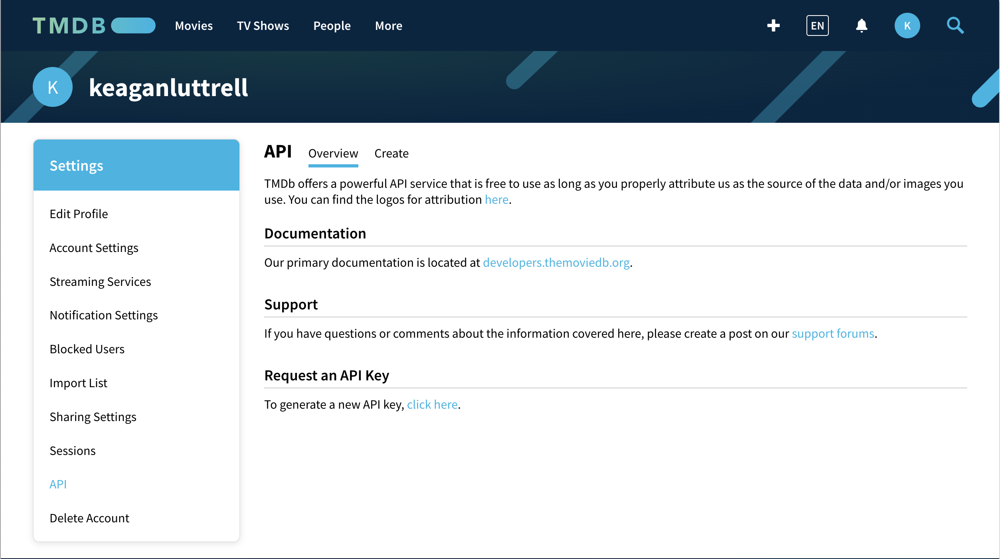
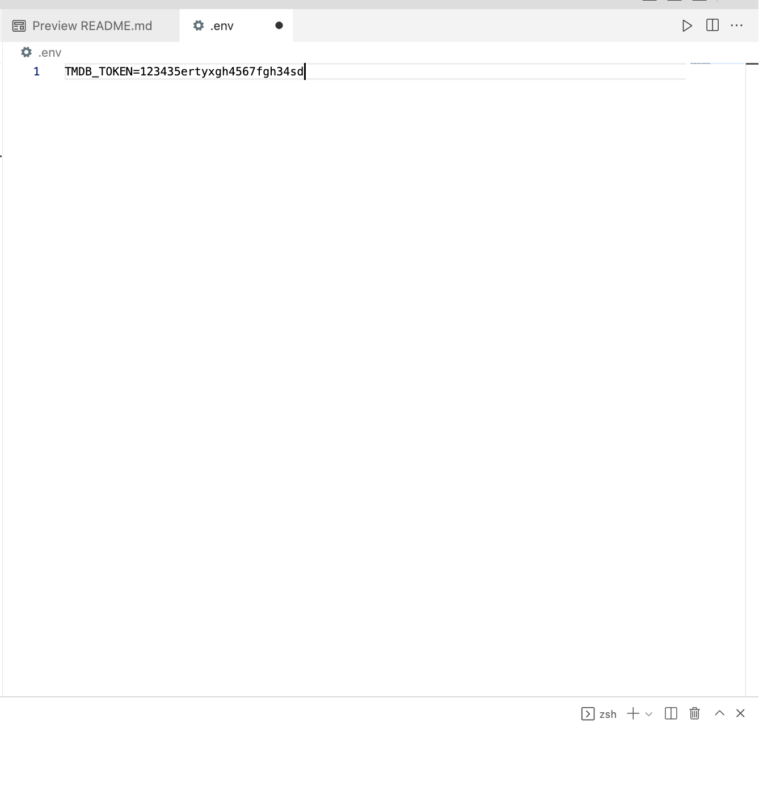
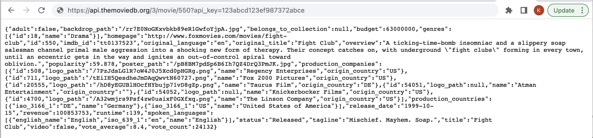

# Movie List

## Get Started

Be sure to fork this repo and clone from your git repo
```bash
mkdir react && cd react
git clone '<<your fork>>'
```
Install Dependencies
```
npm install
```

Go to [TODO.md](TODO.md) to see requirements for this exercise.

## Request API Key

1. Follow instructions to get a new API token.

2. [Login](https://www.themoviedb.org/login) OR
[Signup](https://www.themoviedb.org/signup) to TMDB

3. Once you have ceated your account, then go to _Settings_ tab under your avatar at top right of screen and click then click _API_ tab


4. Then click to generate a new _API_ link

5. Click request API key link and choosee Developer and fill out the forms. Under the drop down choose education. You should not have to pay for anything.

6. You will get an email with your API key, save this to a file named ```.env``` in the root directory of your project


7. Run test link from url to check access

```bash
https://api.themoviedb.org/3/movie/550?api_key=<TMDB_TOKEN>
```

output:


_**Docs**_:
[The Movie DB API token Docs](https://developers.themoviedb.org/3/getting-started/introduction)

---

